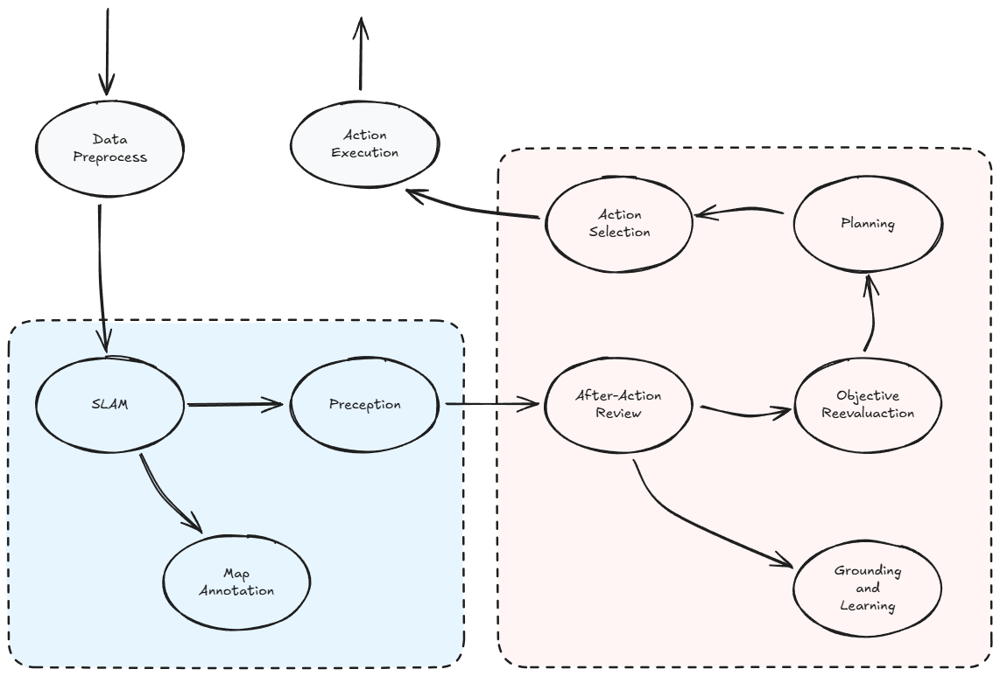

# Miner/Agent Development 🤖

---

## Basic Concepts

### Synapse Data

Check the `protocol.Observation` synapse definition. The validator will send the following data to miners:

* `stats`: Data such as Agent integrity, energy level, etc. (Not yet implemented).
* `items`: The items and item amount, description in Agent's inventory.
* `sensor`: LiDAR and Odometry data indicating distance and space. This will be explained further in the next section.
* `perception`: Text descriptions of the surrounding environment, including terrain, characters, and objects. And a list of environmental interactions, such as passive dialogue, damage, etc.
* `action_log`: The result of the last action executed.
* `action_space`: A list of available actions in the OpenAI function call definition format.

The miner's primary task is to process all this information and respond with a valid function call.


### The Story

The story unfolds in an unspecified future era. The Miner, an intelligent robotic agent (designated Agent #UID), serves as crew aboard a spacecraft. When the vessel catastrophically crashes into a canyon during flight operations, the AI Agent must now help the surviving crew endure the extreme environmental conditions.


### Compass Directions

Eastworld subnet uses 8 directions to describe position relations:

  - north (Cardinal directions)
  - east
  - south
  - west
  - northeast (Ordinal directions)
  - southeast
  - southwest
  - northwest


### LiDAR Scanner Data Interpretation:

The LiDAR data indicates whether a direction is passable:

  - intense: Indicates a strong reflection signal, meaning the direct path is completely blocked.  
  - strong: Indicates a relatively strong reflection signal, suggesting there is an obstacle nearby, but forward movement may still be possible.  
  - moderate: Indicates a moderate signal strength, implying no obstacles in the mid-to-short range, and passage is possible.  
  - weak: Indicates a weak reflection signal, meaning the path ahead is clear of obstacles.  

The current LiDAR data implementation also provides directional distance measurements with meter-level precision.


### Available Actions

Here are the basic actions for agents so far. You should not hardcode them in the prompt, as the `action_space` already includes all of these descriptions.

  - move_in_direction: Moves in the specified direction.
  - move_to_target: Move towards the specified target entity. Target can be a character or a location and must be in sight.
  - talk_to: Talk to other entity. Accepts the name of the target and the content you want to say. The target may not hear you if you're too far away.
  - inspect: Examine a specified target to obtain detailed information, such as character status, item identification, or device operation instructions.
  - collect: Collect resources or items from the specified target entity.
  - discard_item: Discard items from the inventory.


### Quest System

Quests advance through conversation (`talk_to`), not separate commands. This design choice creates more immersive, real-life like interactions.


## Reference Miners

### Junior Agent

The `JuniorAgent` is a naive implementation of the ReAct paradigm and an ephemeral memory system.


### Reasoning Agent

Usually, the response time of a reasoning model is too long to fit within the 20-second timeout of validator requests. `ReasoningAgent` adopts an asynchronous reflection architecture that effectively avoids timeouts while retaining the full capabilities of reasoning models. It is still a basic agent following the ReAct paradigm, but thanks to the reasoning models, it demonstrates enhanced cognitive efficacy without introducing a complicated workflow.

Here are a few **IMPORTANT** things to note:

- The miner is runnable but intended as a reference or demo. You are encouraged to develop your own.

- There is no unified interface for reasoning model providers; you need to modify the code according to the model you use. `ReasoningAgent` is built on OpenAI's API.

- Reasoning models are much more expensive. Please calculate the cost and usage before deploying online.


### Senior Agent

The `SeniorAgent` provides a modular framework for architecting general-purpose AI agents with integrated navigation and cognitive capabilities.



The code in `action_execution` also exemplifies the integration of local and remote function calls to extend agent capabilities, demonstrating a hybrid execution paradigm.

#### Installation

`SeniorAgent` introduces extra dependencies. Install with `uv`:

```
uv sync --extra miner
uv pip install -e .
```

If you have encounterd "Segmentation fault" running miner, please build GTSAM from source (develop branch)

```
git clone https://github.com/borglab/gtsam.git

# After install the gtsam requirements (boost, cmake, etc)

cd gtsam/python
uv pip install -r dev_requirements.txt
cmake .. -DGTSAM_BUILD_PYTHON=1 -DGTSAM_PYTHON_VERSION= **YOUR PYTHON VERSION**
make

cd python && uv pip install .
# Or `make python-install` if you're using pip only

```

GTSAM official install reference: https://github.com/borglab/gtsam/tree/develop/python


#### SLAM

Two algorithm approaches are provided to demonstrate SLAM integration with sensor data in the Synapse:

* FastSLAM
* ISAM (default)

And a simple web page to visualize the SLAM status:

```
python eastworld/miner/slam/console.py --port 5000
```


#### Memory

The `JSONFileMemory` class persists agent memory data in JSON format to a `memory.json` file within the working directory by default. For production deployments, we recommend implementing alternative storage backends like SQLite or other persistent database solutions.

#### LLM Provider

While `SeniorAgent` employs the generic OpenAI SDK for LLM calls and is theoretically model-agnostic, the current implementation specifically utilizes the Gemini 2.0 model (selected for its notable inference speed). Note that prompt engineering is optimized for Gemini's architecture, and modifying the LLM provider requires a little code adjustments, such as adjusting hard-coded model names.


---

## Community

In the competitive world of Bittensor subnets, we understand that miners may be reluctant to share their success strategies. However, we still encourage you to post your ideas, experiences, and breakthroughs to the community. The technology behind general AI agents (or embodied agent, generally-capable agent) is in its early stages. Open discussion and collaboration are key to accelerating progress, and will ultimately benefit everyone in the long run. Eastworld subnet will maintain continuous evolution through periodic integration of cutting-edge research advancements.